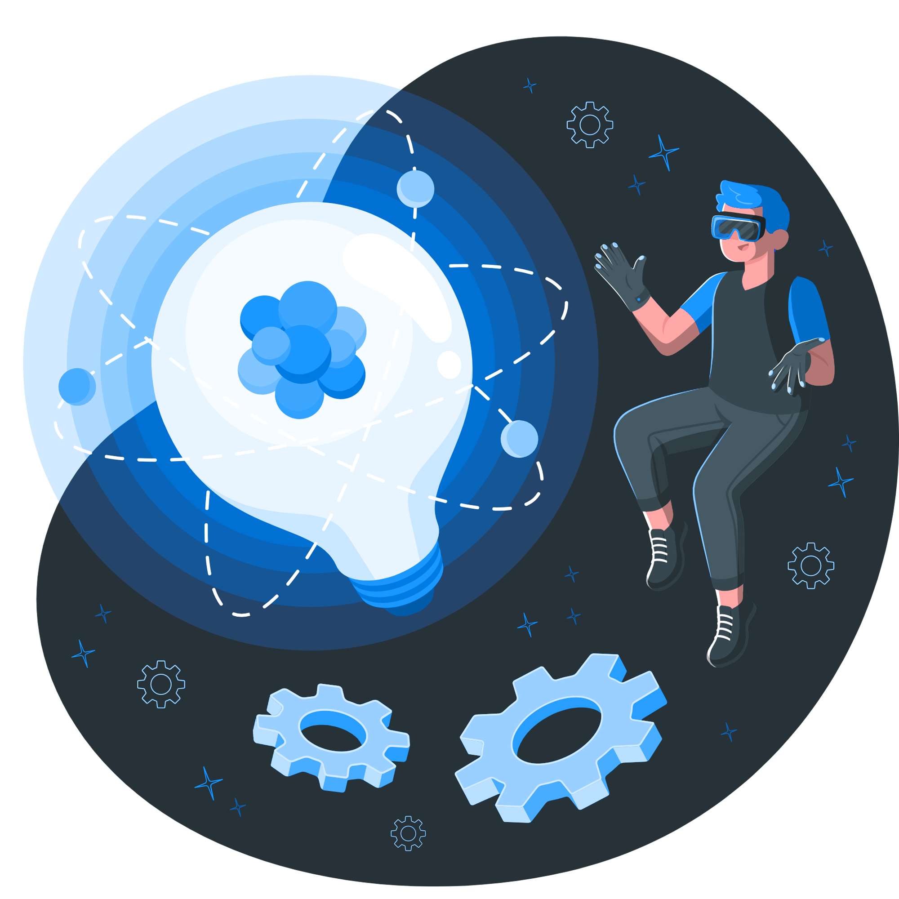

## Hello there! 👋🏽

  

### 📘 About me:

 Sup! My name is Vitor Ribeiro, a passionate developer with 4 years of experience in software development. I’m currently a Computer Science student with strong skills in TypeScript, Python, and Lua. Beyond coding, I’ve led projects and managed teams, gaining hands-on experience in driving innovative solutions. I’m an active member of tech communities on Discord and love attending in-person events to exchange ideas and stay on top of the latest trends. I’ve also had the opportunity to teach web development workshops, guiding others on how to build complete backend applications. My goal is to keep evolving as a developer, contribute to impactful projects, and inspire others through knowledge sharing.

  

### 👔 Contact me:

### ⚙️ GitHub Analytics

 

 

  
 

